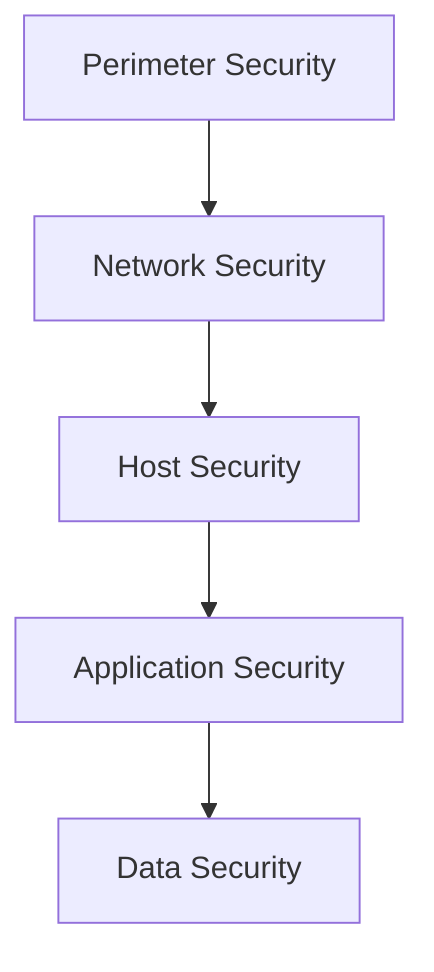

# Defensive Security

## Blue Team Fundamentals

### Defense in Depth Strategy



---

## System Hardening

### Windows Hardening Checklist

#### User Accounts & Authentication
- [ ] Enforce strong password policy (12+ chars, complexity)
- [ ] Enable account lockout policy (5 attempts, 30 min lockout)
- [ ] Disable Guest account
- [ ] Rename Administrator account
- [ ] Remove unnecessary user accounts
- [ ] Enable Windows Hello / MFA where possible

#### Services & Features
- [ ] Disable unnecessary services
- [ ] Remove unused Windows features
- [ ] Disable SMBv1 protocol
- [ ] Enable Windows Defender
- [ ] Configure Windows Firewall

#### System Configuration
```powershell
# Disable SMBv1
Set-SmbServerConfiguration -EnableSMB1Protocol $false

# Enable PowerShell logging
Set-ItemProperty -Path "HKLM:\Software\Policies\Microsoft\Windows\PowerShell\ScriptBlockLogging" -Name "EnableScriptBlockLogging" -Value 1

# Enable Windows Defender real-time protection
Set-MpPreference -DisableRealtimeMonitoring $false
```

### Linux Hardening Checklist

#### User Security
- [ ] Disable root SSH login
- [ ] Use SSH keys instead of passwords
- [ ] Configure sudo properly
- [ ] Set password policies in `/etc/login.defs`
- [ ] Remove unused user accounts

#### SSH Hardening
```bash
# Edit /etc/ssh/sshd_config
PermitRootLogin no
PasswordAuthentication no
PubkeyAuthentication yes
Port 2222  # Non-standard port
MaxAuthTries 3
ClientAliveInterval 300
ClientAliveCountMax 2
```

#### Firewall Configuration
```bash
# UFW (Uncomplicated Firewall)
sudo ufw default deny incoming
sudo ufw default allow outgoing
sudo ufw allow 2222/tcp  # SSH on custom port
sudo ufw enable
```

---

## Network Security

### Network Segmentation

| Segment | Purpose | Trust Level | Access Controls |
|---------|---------|-------------|-----------------|
| DMZ | Public-facing services | Low | Strict filtering |
| Internal | User workstations | Medium | Standard ACLs |
| Server VLAN | Internal servers | Medium-High | Role-based access |
| Management | Admin access | High | MFA + Jump box |
| Guest | Visitor network | Very Low | Isolated |

### Monitoring & Detection

#### Key Log Sources
- Windows Event Logs (Security, System, Application)
- Syslog from Linux systems
- Firewall logs
- Proxy/Web gateway logs
- EDR/Antivirus alerts
- Authentication servers (AD, RADIUS)

#### Critical Events to Monitor

!!! danger "High Priority Alerts"
    - Multiple failed login attempts
    - Privilege escalation
    - New admin account creation
    - Unusual outbound connections
    - Large data transfers
    - Service account usage outside business hours
    - Changes to security group membership

---

## Security Tools

### Essential Defensive Tools

#### SIEM Solutions
- Splunk
- Elastic Stack (ELK)
- Microsoft Sentinel
- Graylog

#### Endpoint Protection
- Microsoft Defender for Endpoint
- CrowdStrike Falcon
- SentinelOne
- Carbon Black

#### Network Monitoring
- Zeek (formerly Bro)
- Suricata
- Wireshark
- NetworkMiner

---

## Best Practices

### Patch Management
1. Test patches in non-production environment
2. Prioritize critical security patches
3. Maintain patch compliance tracking
4. Schedule regular maintenance windows

### Backup Strategy (3-2-1 Rule)
- **3** copies of data
- **2** different media types
- **1** copy offsite

### Access Control
- Principle of Least Privilege
- Regular access reviews
- Time-based access for temporary needs
- Separation of duties for critical functions

---

!!! tip "Defense Mindset"
    Assume breach mentality - plan for detection and response, not just prevention.

